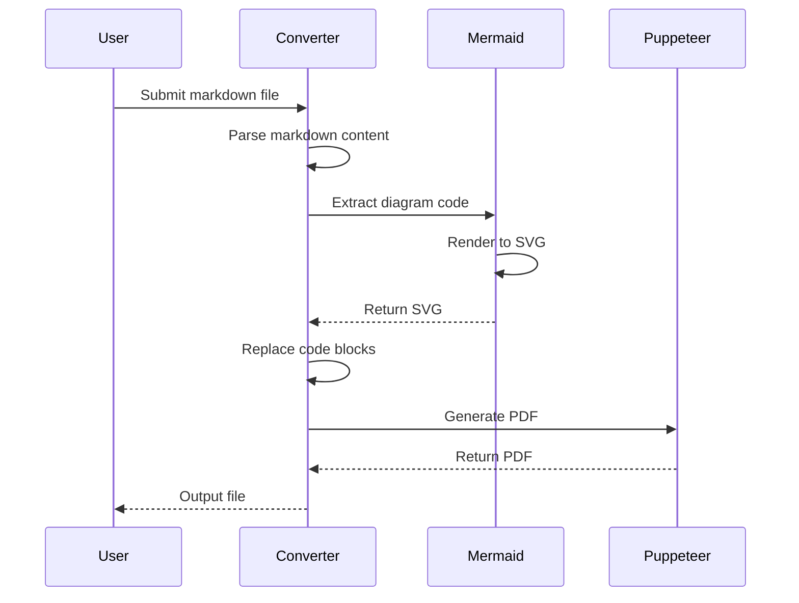
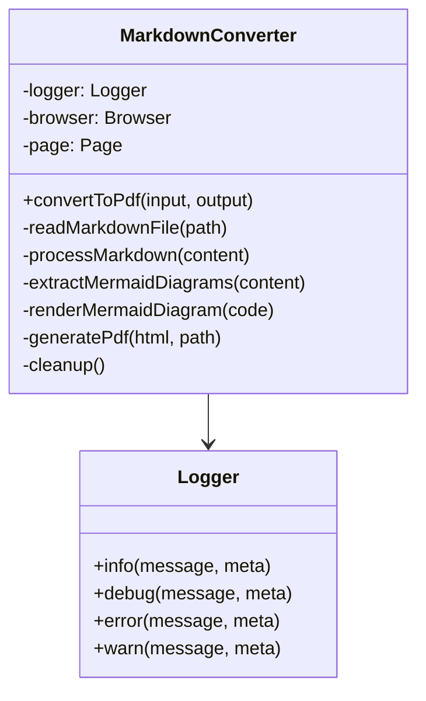
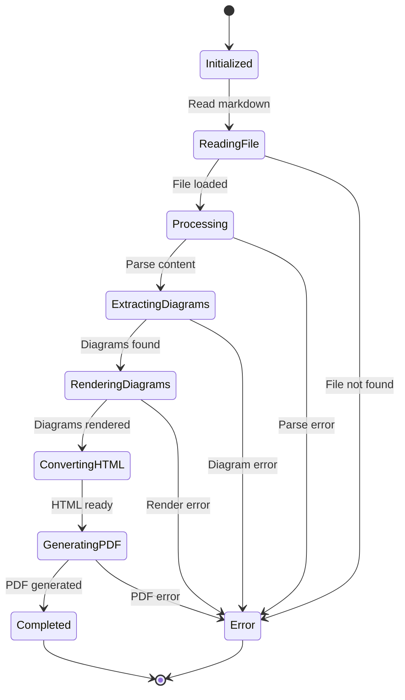
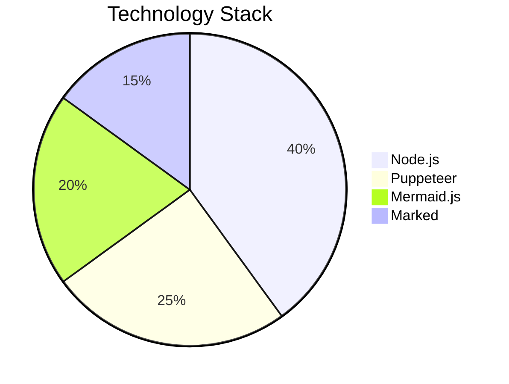
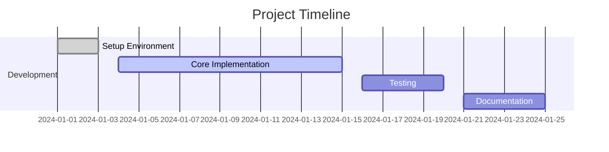
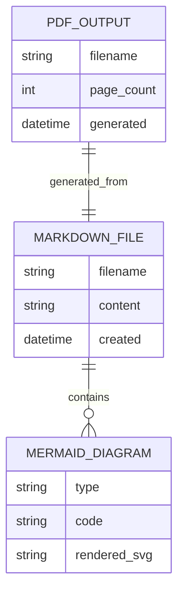
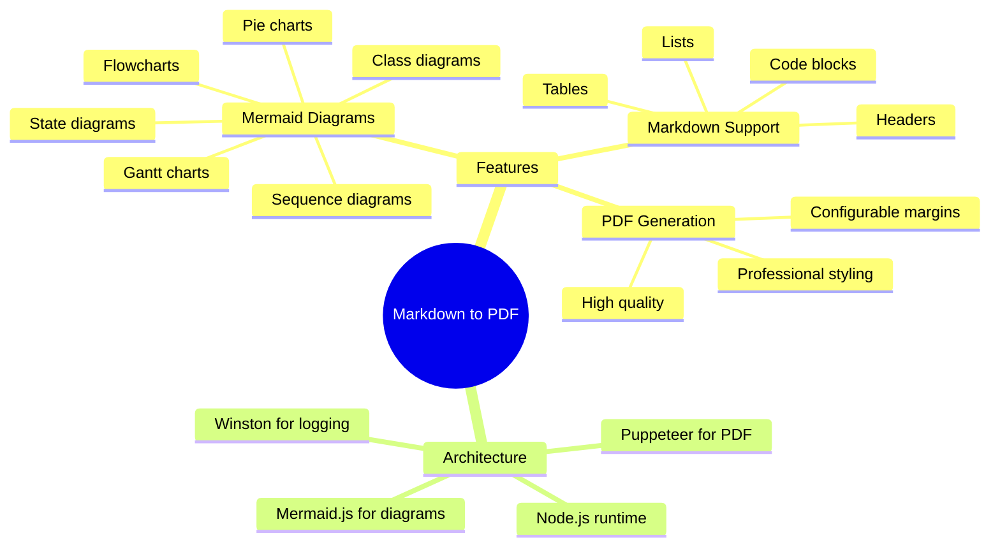

# Complex Markdown Document with Multiple Diagrams

This document demonstrates various types of Mermaid diagrams and complex markdown features.

## System Architecture

### Sequence Diagram

### Class Diagram

### State Diagram

## Pie Chart Example

## Gantt Chart

## Entity Relationship Diagram

## Mind Map

## Configuration Options

The application supports various configuration options through environment variables:

- `LOGGING_ENABLED`: Enable/disable logging (default: true)
- `LOG_LEVEL`: Set log level (debug, info, warn, error)
- `LOG_DIR`: Directory for log files
- `NODE_ENV`: Environment mode (development, production)

## Advanced Features

### Custom Styling

The generated PDF includes professional styling with:
- Clean typography
- Proper spacing
- Syntax highlighting for code blocks
- Responsive diagram rendering
- Professional color scheme

### Error Handling

The application includes comprehensive error handling:
- File not found errors
- Mermaid diagram rendering errors
- PDF generation failures
- Graceful cleanup of resources

### Performance Considerations

- Efficient diagram rendering
- Memory management
- Resource cleanup
- Optimized PDF generation 