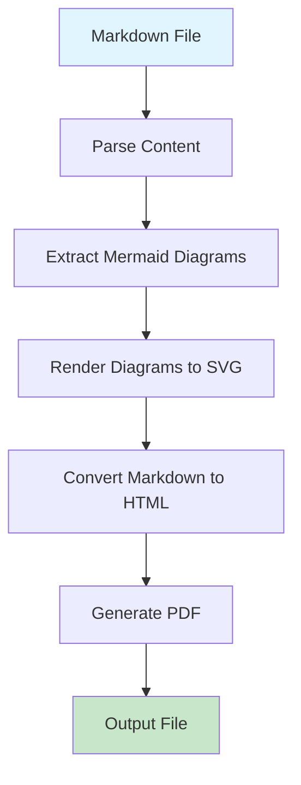

# Sample Markdown Document

This is a sample markdown document that demonstrates the conversion capabilities of our markdown-mermaidjs-to-pdf converter.

## Features

- **Markdown Support**: Full markdown syntax support
- **Mermaid Diagrams**: Embedded Mermaid diagram rendering
- **PDF Output**: Clean, professional PDF generation
- **Logging**: Comprehensive logging for debugging

## Sample Flowchart

Here's a simple flowchart demonstrating the conversion process:



## Code Example

Here's some sample code:

```javascript
function convertMarkdown(input, output) {
    const converter = new MarkdownConverter();
    return converter.convertToPdf(input, output);
}
```

## Lists

### Unordered List
- Item 1
- Item 2
- Item 3

### Ordered List
1. First step
2. Second step
3. Third step

## Tables

| Feature | Status | Notes |
|---------|--------|-------|
| Markdown | ✅ | Full support |
| Mermaid | ✅ | All diagram types |
| PDF Output | ✅ | High quality |
| Logging | ✅ | Configurable |

## Blockquotes

> This is a blockquote that demonstrates how quoted text appears in the generated PDF.

## Conclusion

This sample demonstrates the basic functionality of the markdown-mermaidjs-to-pdf converter. The Mermaid diagram above should be properly rendered in the final PDF output. 