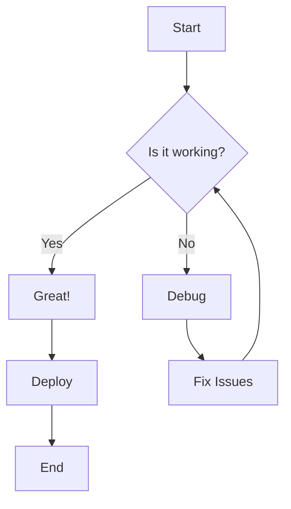
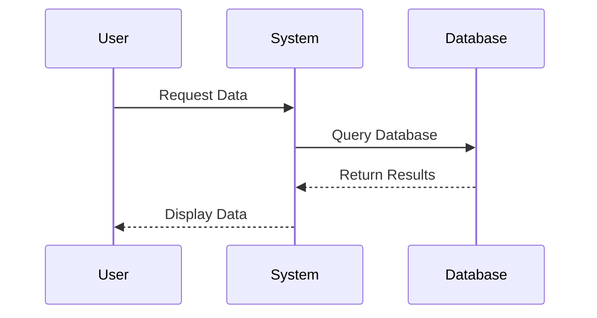

# Test Document for CI/CD Pipeline

This is a test document used by the GitHub Actions CI/CD pipeline to verify that the markdown-mermaidjs-to-pdf converter works correctly.

## Features to Test

The converter should handle:
- Basic markdown formatting
- Mermaid diagrams
- Code blocks
- Lists and tables

## Sample Mermaid Diagram



## Another Diagram



## Code Example

Here's some sample code:

```javascript
function convertMarkdown(markdown) {
    return marked.parse(markdown);
}

function generatePDF(html) {
    return puppeteer.launch()
        .then(browser => browser.newPage())
        .then(page => page.setContent(html))
        .then(page => page.pdf());
}
```

## Test Results

- [x] Markdown parsing
- [x] Mermaid diagram rendering
- [x] PDF generation
- [x] CI/CD pipeline integration

## Conclusion

If this document converts to PDF successfully, the CI/CD pipeline is working correctly! 